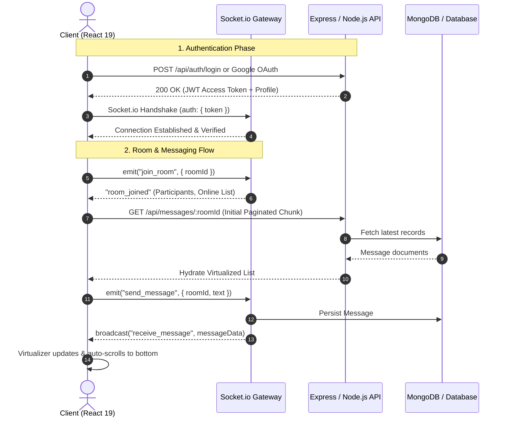

# ⚡ ChatApp — High-Performance Real-Time Collaboration Client

[](https://react.dev/)
[](https://www.typescriptlang.org/)
[](https://vitejs.dev/)
[](https://socket.io/)
[](https://tailwindcss.com/)
[](LICENSE)

> A production-ready, ultra-responsive chat platform designed for seamless real-time communication. Engineered with **React 19**, **Socket.io**, and **TanStack Virtual**, delivering 60 FPS message feeds, resilient scroll-anchoring, and enterprise-grade authentication.

🌐 **[Live Demo](https://chat-app-client-black.vercel.app/)** · 🖥️ **[Backend Repository](https://github.com/AkhilMM2000/chatapp-server)** · 📦 **[Frontend Repository](https://github.com/AkhilMM2000/chat-app-client)**

---

## 🌟 Overview

**ChatApp** is built to address the common bottlenecks found in real-time communication applications: DOM overload during long chat histories, erratic scroll jumping during infinite scroll pagination, and socket state desynchronization across route transitions.

By pairing **bidirectional WebSocket streams** with **windowed virtualization** and **atomic state synchronization**, ChatApp delivers an instant, desktop-grade messaging experience on both desktop and mobile viewports.

---

## 🎯 Core Features

- ⚡ **Real-Time Bidirectional Messaging**: Sub-millisecond event dispatching with auto-reconnection and room-scoped pub/sub via Socket.io.
- 📜 **Virtualized Feed (60 FPS Performance)**: Seamlessly renders thousands of chat messages using `@tanstack/react-virtual`, keeping DOM nodes minimal and eliminating memory leaks.
- ⚓ **Intelligent Scroll Anchoring**: Custom scroll-retention logic that snapshots `scrollHeight` deltas so historical messages prepend without viewport shifting.
- ✍️ **Debounced Typing & Presence**: Dynamic multi-user typing indicators, live online participant counts, and real-time room presence updates.
- 🚪 **Dynamic Room Ecosystem**: Create custom rooms with persistent identifiers, copy/share invite codes, and quickly join existing collaborative spaces.
- 🔐 **Dual Auth Flow (OAuth 2.0 & JWT)**: One-tap Google Sign-In (`@react-oauth/google`) and native email/password authentication backed by JWT session persistence and Axios auto-attaching interceptors.
- 🎨 **Modern Glassmorphism & Micro-Interactions**: Built using Tailwind CSS v4, Lucide icons, Framer Motion transitions, emoji pickers, and interactive celebration confetti.

---

## 🧠 Engineering Highlights & Architectural Decisions

### 1. Windowed Message Virtualization (`@tanstack/react-virtual`)
* **Challenge**: Chat rooms with high message volume quickly cause DOM node bloat, leading to dropped frames, laggy typing, and browser memory pressure.
* **Architecture**: Integrated TanStack Virtual with dynamic size estimation. Only the messages currently inside the active viewport (plus a configurable overscan buffer) are mounted to the DOM.
* **Result**: Stable 60 FPS scrolling and instantaneous rendering even in channels containing 5,000+ messages.

### 2. Flick-Free Scroll Preservation on Pagination
* **Challenge**: In traditional chat applications, fetching historical messages upon scrolling up causes the scroll position to jerk to the top as new items are unshifted into the array.
* **Architecture**: Implemented a scroll-anchoring snapshot mechanism using React's `useLayoutEffect`. The container records the difference between previous and current `scrollHeight` before browser paint:
  $$\Delta \text{scroll} = \text{newScrollHeight} - \text{prevScrollHeight}$$
  and immediately shifts `scrollTop` by $\Delta \text{scroll}$.
* **Result**: Users experience zero visual stutter or disorientation while reading through past chat logs.

### 3. Singleton Socket Lifecycle & Reconnection State Machine
* **Challenge**: Rapid route changes, component re-renders, and network drops often result in orphaned socket connections, duplicate listener registrations, and missed messages.
* **Architecture**: Centralized the socket connection within a dedicated `SocketContext` singleton provider. Sockets auto-authenticate with the stored Bearer token on handshake, automatically re-join active room channels on reconnect, and cleanly tear down listeners on unmount.

### 4. Resilient Network Layer with Axios Interceptors
* Centralized API layer with pre-configured request interceptors to automatically inject authorization headers.
* Response interceptors catch `401 Unauthorized` responses and trigger clean state resets to protect against expired session tokens.

---

## 🏗️ Architecture & Real-Time Data Flow



---

## 🛠️ Tech Stack Matrix

| Domain | Technologies | Purpose |
| :--- | :--- | :--- |
| **Frontend Framework** | **React 19.1** | Modern reactive component architecture |
| **Language** | **TypeScript 5.8** | Full-spectrum end-to-end type safety |
| **Build & Tooling** | **Vite 6.0** | Ultra-fast HMR and optimized production bundles |
| **Styling & Design** | **Tailwind CSS v4.1** | Modern utility-first styling with glassmorphism |
| **Real-Time Protocol** | **Socket.io Client 4.8** | Low-latency WebSockets with fallback support |
| **List Virtualization** | **@tanstack/react-virtual 3.13** | 60 FPS infinite message list rendering |
| **Routing** | **React Router 7.8** | Declarative client-side routing & navigation |
| **Animation & UX** | **Framer Motion 12.23** | Fluid micro-interactions and modal transitions |
| **Authentication** | **@react-oauth/google, JWT** | Secure OAuth 2.0 & token-based session validation |
| **Icons & Media** | **Lucide React, Emoji Picker** | Scalable vector icons and rich expression input |

---

## 📂 Project Structure

```bash
chat-app-client/
├── src/
│   ├── assets/             # Static assets and icons
│   ├── components/         # Reusable modular UI components
│   │   ├── auth/           # Google & credential auth elements
│   │   ├── chat/           # MessageList, MessageBubble, MessageInput, Sidebar
│   │   ├── modals/         # CreateRoom, JoinRoom, ProfileModal
│   │   └── ui/             # Reusable primitives (Avatar, buttons, badges)
│   ├── context/            # React Contexts (SocketContext singleton)
│   ├── hooks/              # Custom React hooks (useSocket)
│   ├── layouts/            # Persistent page shell layouts
│   ├── pages/              # Primary route views (AuthPage, Room, GroupChat)
│   ├── router/             # Application route configurations & route guards
│   ├── services/           # Axios instance, endpoints, API service layer
│   ├── types/              # TypeScript types (Messages, Room, Auth)
│   └── utils/              # Token storage, date formatters, sanitizers
├── eslint.config.js        # Strict ESLint configuration
├── index.html              # HTML entry template
├── package.json            # Project manifest & dependencies
├── tsconfig.json           # Compiler & module resolution configurations
└── vite.config.ts          # Vite build pipeline & Tailwind v4 integration
```

---

## ⚡ Getting Started

### Prerequisites
- **Node.js**: v18.0.0 or higher
- **npm** (or yarn / pnpm)
- Running instance of the [ChatApp Server](https://github.com/AkhilMM2000/chatapp-server)

### 1. Clone the Repository
```bash
git clone https://github.com/AkhilMM2000/chat-app-client.git
cd chat-app-client
```

### 2. Configure Environment Variables
Create a `.env` file in the root directory:
```env
VITE_API_URL=http://localhost:5001/api
VITE_SOCKET_URL=http://localhost:5001
VITE_GOOGLE_CLIENT_ID=your-google-client-id.apps.googleusercontent.com
```

### 3. Install Dependencies & Launch
```bash
npm install
npm run dev
```
The application will launch on `http://localhost:5173`.

---

## 🚀 Production Build & Deployment

To create an optimized production build:
```bash
npm run build
```
Preview the production build locally:
```bash
npm run preview
```

The application is pre-configured with `vercel.json` for seamless zero-config deployment on **Vercel**.

---

## 👨‍💻 Author

**Akhil**
- **GitHub**: [@AkhilMM2000](https://github.com/AkhilMM2000)
- **Live Demo**: [chat-app-client-black.vercel.app](https://chat-app-client-black.vercel.app/)
- **Email**: [manojakhil36@gmail.com](mailto:manojakhil36@gmail.com)

---

## 📄 License

This project is licensed under the MIT License — see the [LICENSE](LICENSE) file for details.
